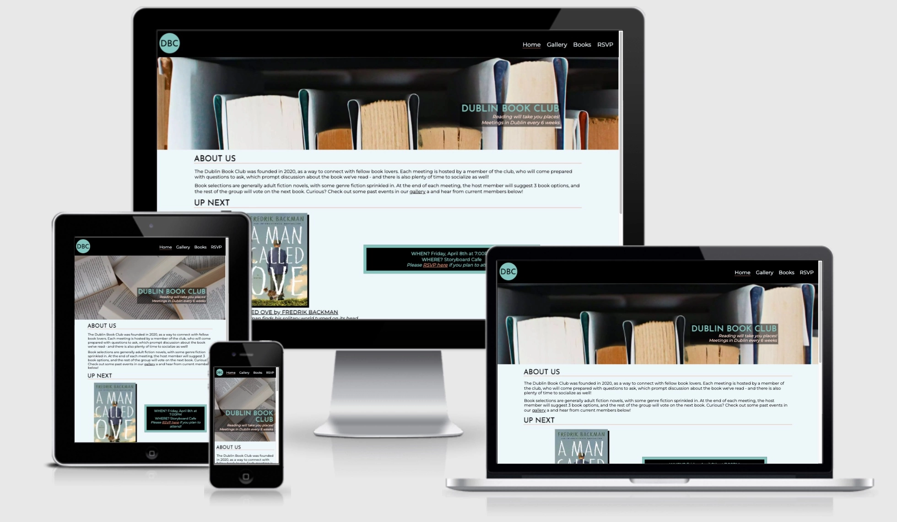

<h1>Dublin Book Club</h1>

[View the live project here.](https://stephhjar.github.io/dublin-book-club/)

This is the home page for the Dublin Book Club, a fiction book club for adults of all ages based in Dublin. The goal of the website is to provide the user with information about the club, including when it was founded, previous books, a photo gallery, testimonials from current members, and form to register your attendance at the next meeting. It was designed to be responsive and accessible across all devices.



## User Experience (UX)

-   ### User stories

    -   #### First Time Visitor Goals

        1. As a First Time Visitor, I want to understand what the Dublin Book Club is, and the purpose of the website.
        2. As a First Time Visitor, I want to understand how to navigate the site to find content and information easily.
        3. As a First Time Visitor, I want to find out what happens at book club meetings, and how they are organized. I want to see photos from previous events and hear from members. 

    -   #### Returning Visitor Goals

        1. As a Returning Visitor, I want to find out the date and time of the next meeting. 
        2. As a Returning Visitor, I want to find out what the next book selection is. 
        3. As a Returning Visitor, I want to register my attendance/RSVP to the next meeting.

    -   #### Frequent User Goals
        1. As a Frequent User, I want to see new photos and updated testimonials from recent book club meetings.
        2. As a Frequent User, I want to see what previous book selections were that I may have missed, and purchase previous and upcoming books.

-   ### Design
    -   #### Colour Scheme
        -   The main colours used are black, light blue, turquoise, and orange. I wanted to choose colours that are not
        typically considered 'gendered'. Book clubs can be associated as more targeted towards women, and I wanted to create
        a site that made it clear the group is open to anyone of all ages and genders. 
    -   #### Typography
        -   Josefin Sans was used for headers and Montserrat for the main text of the webpage. Both fonts look clean and professional, are accessible and easy to read. 
    -   #### Imagery
        -   All images (hero image, gallery images, and the image on the RSVP page) are related to either books and reading, or (in the case of the gallery) being out at a cafe for the book club meetings. The colours don't clash with the colour scheme of the page, and all images are clear, bright and appealing.

*   ### Wireframes

    -   Desktop Wireframe - [View](assets/readme/desktop.pdf)

    -   Tablet Wireframe - [View](assets/readme/tablet.pdf)

    -   Mobile Wireframe - [View](assets/readme/mobile.pdf)

## Features

-   Responsive on all device sizes:
    - Mobile: [Home](assets/readme/mobile-home.png) | [Gallery](assets/readme/mobile-gallery.png) | [Books](assets/readme/mobile-books.png) | [RSVP](assets/readme/mobile-home.png)
    - Tablet: [Home](assets/readme/tablet-home.png) | [Gallery](assets/readme/tablet-gallery.png) | [Books](assets/readme/tablet-books.png) | [RSVP](assets/readme/tablet-home.png)
    - Desktop: [Home](assets/readme/tablet-home.png) | [Gallery](assets/readme/tablet-gallery.png) | [Books](assets/readme/tablet-books.png) | [RSVP](assets/readme/tablet-home.png)

-   Interactive elements:
    - Logo: The logo is being used in the place of a header across all pages. Clicking the logo will bring the user to the home page. 
    
    - Nav bar: The page the user is currently on is underlined, so navigation is clear, and links turn orange when hovered over, to make it clear these are interactive links.
    
    - Book titles: The titles of books on the home page and the 'previous books' page are clickable, and direct the user to the GoodReads page for each book in a new window. The underline on each link disappers on hover to make it clear these links are interactive. 
    
    - RSVP link: There is a link to the RSVP page in the details of the next meeting, as a call to action to the user to sign up if they are interested in attending. On hover, the underline disappears.  
    
    - Testimonials carousel: On smaller screen sizes (less than 650 pixels) the testimonials appear in an interactive carousel. The user can either swipe with ther finger, or click on the numbers beneath the carousel to navigate between testimonials.  
    
    - Social media links: At the bottom of each page are social media links using FontAwesome icons. On hover the links chnage colour to orange to make it clear these are interactive.
    
    - RSVP form: There is a form to RSVP to the next book club event. On hover the form fields' border turns orange, and the colours reverse on the submit button.  
    

## Technologies Used

### Languages Used

-   [HTML5](https://en.wikipedia.org/wiki/HTML5)
-   [CSS3](https://en.wikipedia.org/wiki/Cascading_Style_Sheets)

### Frameworks, Libraries & Programs Used

1. [Google Fonts:](https://fonts.google.com/)
    - Google fonts were used to import the 'Josefin Sans' and 'Montserrat' fonts into the style.css file which is used on all pages throughout the project.
1. [Font Awesome:](https://fontawesome.com/)
    - Font Awesome was used on all pages throughout the website to add social media icons for aesthetic and UX purposes.
1. [Git](https://git-scm.com/)
    - Git was used for version control by utilizing the Gitpod terminal to commit to Git and Push to GitHub.
1. [GitHub:](https://github.com/)
    - GitHub is used to store the projects code after being pushed from Git.
1. [Balsamiq:](https://balsamiq.com/)
    - Balsamiq was used to create the [wireframes](https://github.com/StephHjar/dublin-book-club/tree/main/assets/readme) during the design process.

## Testing

The W3C Markup Validator and W3C CSS Validator Services were used to validate every page of the project to ensure there were no syntax errors in the project.

-   [W3C Markup Validator](https://validator.w3.org/#validate_by_input) - Results: [Home](assets/readme/html-validated-home.pdf) | [Gallery](assets/readme/html-validated-gallery.pdf) | [Books](assets/readme/html-validated-books.pdf) | [RSVP](assets/readme/html-validated-books.pdf)
-   [W3C CSS Validator](https://jigsaw.w3.org/css-validator/#validate_by_input) - [Results](assets/readme/css-validated.pdf)

### Testing User Stories from User Experience (UX) Section

-   #### First Time Visitor Goals

    1. As a First Time Visitor, I want to understand what the Dublin Book Club is, and the purpose of the website.
    
        1. On the home page of the site, I can see both the logo in the top left corner, and the full title "Dublin Book Club" over the header image, with a slogan and information that the club meets every 6 weeks. 
        2. There is information on the home page about when & where the next club meeting will take place, and a call to action to RSVP. 
 
    2. As a First Time Visitor, I want to understand how to navigate the site to find content and information easily.

        1. There is a navigation bar on the top right that clearly outlines the different pages available on the website. The navigation bar is fixed to the top of the page so the user can always navigate easily. 
        2. Clicking the logo will also take the user back to the home page. 
 
    3. As a First Time Visitor, I want to find out what happens at book club meetings, and how they are organized. I want to see photos from previous events and hear from members.

-   #### Returning Visitor Goals

    1. As a Returning Visitor, I want to find out the date and time of the next meeting. 

    2. As a Returning Visitor, I want to find out what the next book selection is. 

    3. As a Returning Visitor, I want to register my attendance/RSVP to the next meeting.

-   #### Frequent User Goals

    1. As a Frequent User, I want to see new photos and updated testimonials from recent book club meetings.

    2. As a Frequent User, I want to see what previous book selections were that I may have missed, and purchase previous and upcoming books.

### Further Testing

### Known Bugs (Resolved)

- 'font-weight: bold' was not working in the "next meeting section". Determined this is because the font chosen from Google Fonts did not have a bold weight. Imported a bold version of the font, this resolved the bug.

- Could not vertically align the "Submit" text in the submit button. The padding was equal on all sides, but the font itself has space built in underneath the letters. Adjusted the padding to compensate for this. The downside here is that the text will not appear centred if the custom font is not available or does not load.

- There was a large gap between the "about us" section and the "next up" section due to a fixed height assigned to the 'about us' div. Removed the height from the CSS code so that the sections stay close together.

- Used the "next-book" ID twice in the "up next" section, corrected this to be a class.

- The header div did not fit all the nav bar content at larger screen sizes, so I couldn't vertically center the logo and the nav bar. Adjusted height of header to fit content. Nav bar width was also set to 100%, which prevented it from sitting next to the logo. Changed the nav bar width, which allowed the logo and nav bar to align next to each other at medium and large screen sizes. 

- Testimonials weren't center aligned in their section on larger screens because the flex boxes weren't taking up the entire section. Changed flex-basis so that each of the three flex boxes took up an equal amount of space.

- The carousel was missing the navigator bar due to a missing div tag, which meant the nav buttons were enclosed in the same div as the slides. Replaced the div tag and the bug was fixeed.

- The testimonials in the carousel were overflowing on to the next slide on mobile. Solved this by removing the padding from the individual slides themselves, and adding the padding to the larger carousel container div.

- The social media links in the footer were not fixed to the bottom of the page (regardless of the amount of content). Found a resource on StackOverflow, and discovered that by setting the body as a vertical flex box and aligning the footer underneath it, the social media icons stay fixed closer to the bottom of the page.

## Deployment

### GitHub Pages

The project was deployed to GitHub Pages using the following steps...

1. Log in to GitHub and locate the [GitHub Repository](https://github.com/)
2. At the top of the Repository (not top of page), locate the "Settings" Button on the menu.
    - Alternatively Click [Here](https://raw.githubusercontent.com/) for a GIF demonstrating the process starting from Step 2.
3. Scroll down the Settings page until you locate the "GitHub Pages" Section.
4. Under "Source", click the dropdown called "None" and select "Main Branch".
5. The page will automatically refresh.
6. Scroll back down through the page to locate the now published site [link](https://github.com) in the "GitHub Pages" section.

### Forking the GitHub Repository

By forking the GitHub Repository we make a copy of the original repository on our GitHub account to view and/or make changes without affecting the original repository by using the following steps...

1. Log in to GitHub and locate the [GitHub Repository](https://github.com/)
2. At the top of the Repository (not top of page) just above the "Settings" Button on the menu, locate the "Fork" Button.
3. You should now have a copy of the original repository in your GitHub account.

### Making a Local Clone

1. Log in to GitHub and locate the [GitHub Repository](https://github.com/)
2. Under the repository name, click "Clone or download".
3. To clone the repository using HTTPS, under "Clone with HTTPS", copy the link.
4. Open Git Bash
5. Change the current working directory to the location where you want the cloned directory to be made.
6. Type `git clone`, and then paste the URL you copied in Step 3.

```
$ git clone https://github.com/YOUR-USERNAME/YOUR-REPOSITORY
```

7. Press Enter. Your local clone will be created.

```
$ git clone https://github.com/YOUR-USERNAME/YOUR-REPOSITORY
> Cloning into `CI-Clone`...
> remote: Counting objects: 10, done.
> remote: Compressing objects: 100% (8/8), done.
> remove: Total 10 (delta 1), reused 10 (delta 1)
> Unpacking objects: 100% (10/10), done.
```

Click [Here](https://help.github.com/en/github/creating-cloning-and-archiving-repositories/cloning-a-repository#cloning-a-repository-to-github-desktop) to retrieve pictures for some of the buttons and more detailed explanations of the above process.

## Credits

-   Footer with social media links and the gallery page used code from Code Institute's Love Running walkthrough
-   [Code Institute Sample Readme](https://github.com/Code-Institute-Solutions/SampleREADME) for the README 
-   [Goodreads](https://www.goodreads.com/) for book covers and synopses
-   [TinyPNG](https://tinypng.com/) to compress image sizes
-   [BestSlogans.com](https://www.bestslogans.com/list-ideas-taglines/reading-club-slogans/) for the book club slogan
-   [EightShapes Contrast Grid](https://contrast-grid.eightshapes.com/) was used to ensure color contrast for accessibility.
-   [Coolors.co:](https://coolors.co/) was used to generate a color palette.
-   [Unsplash](https://unsplash.com/) was used for images (hero image, some gallery images, and the image on the RSVP   page).
-   [Pexels](https://www.pexels.com/) was used for some gallery images.
-   [Favicon](https://favicon.io/) was used to generate a logo and favicon.
-   [GitConnected](https://levelup.gitconnected.com/how-to-make-a-fully-accessible-css-only-carousel-40e8bd62032b): This page on GitConnected was used to build a carousel with HTML & CSS.
-   [WebFX](https://www.webfx.com/blog/web-design/circular-images-css/): This page on WebFX was used to make rectangular images circular in the testimonial section.
-   [StackOverflow](https://stackoverflow.com/) was used as a resource and for help while debugging.
-   [CloudConvert](https://cloudconvert.com/) was used to convert images to WEBP format.

### Code

### Content

-   All content was written by the developer except as credited above.

### Media

-   Favicon was used to create the favicon and logo, and other media images were found on Unsplash and Pexels as credited above.

### Acknowledgements

-   My Mentor for continuous helpful feedback!